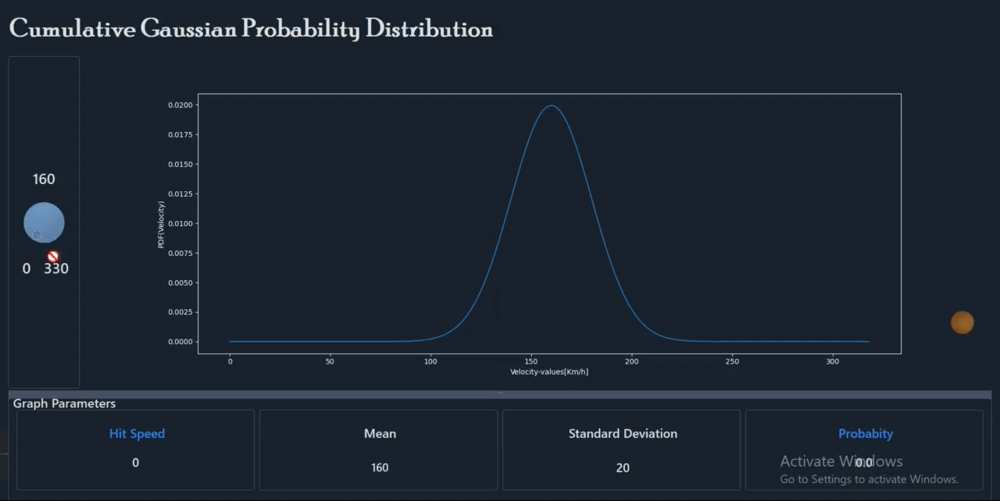
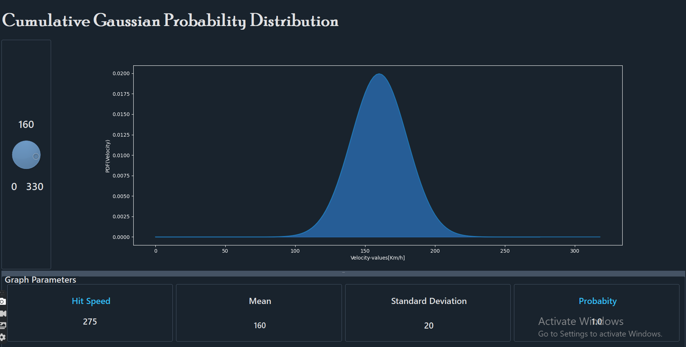

# Cumulative Gaussian Probability Distribution

- [Discription](#Discription)
- [Demos](#demos)
    - [Cumulative Probability Demo](#cumulative-probability-demo)
    - [Cumulative Probability Image](#cumulative-probability-Image)

## Discription
One of the parameters that may play an important role in the ranking of tennis top champs is the ball hitting speed during a correct service. This speed is not counted of course for a faulty service. 

The player's chance to make an Ace (a service which cannot not be returned by the opponent) increases with an increasing ball hitting speed, and consequently with a decreasing landing time. 
If we may consider that this chance of getting an Ace is found to obey a cumulative Gaussian probability distribution of the ball hit speed with a mean of 160 km/h and a standard deviation of 20 km/h.

This is a simulation program with a graphical user interface making use of the ball hit speed as a control knob and the corresponding probability as an indicator.

## Demos

### Cumulative Probability Demo

### Cumulative Probability Image

 
